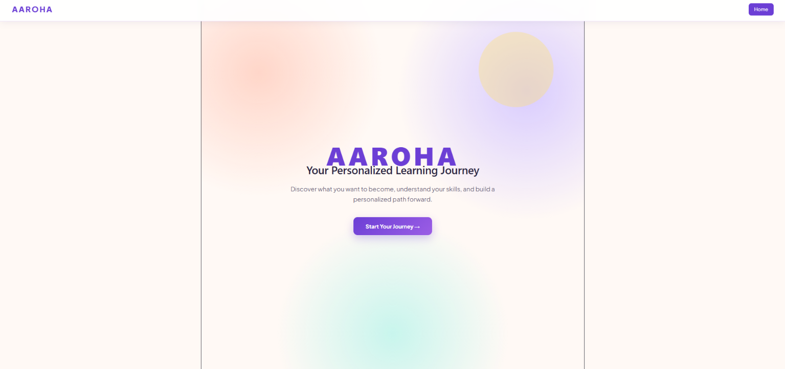
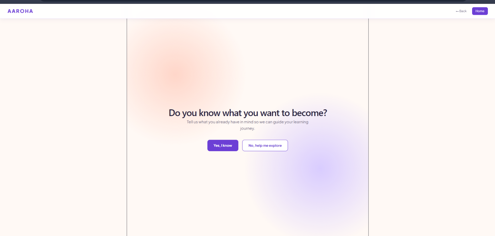
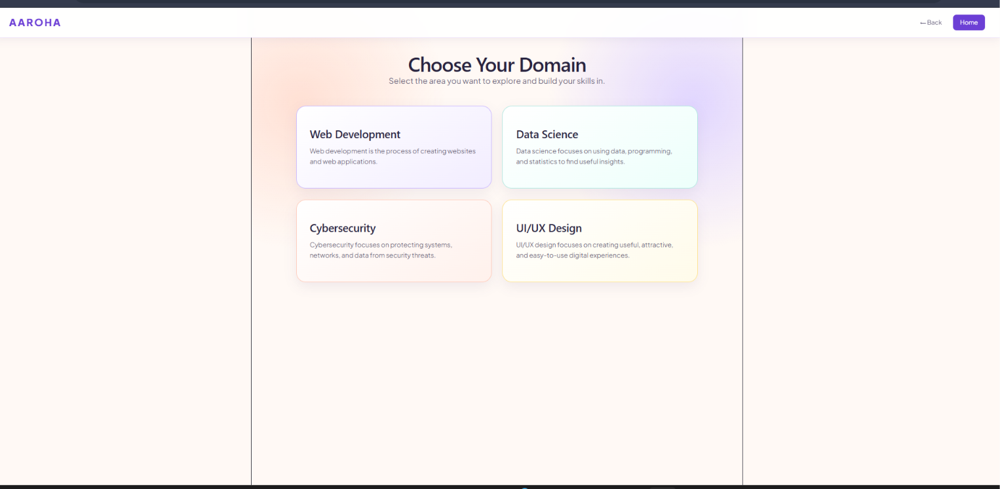
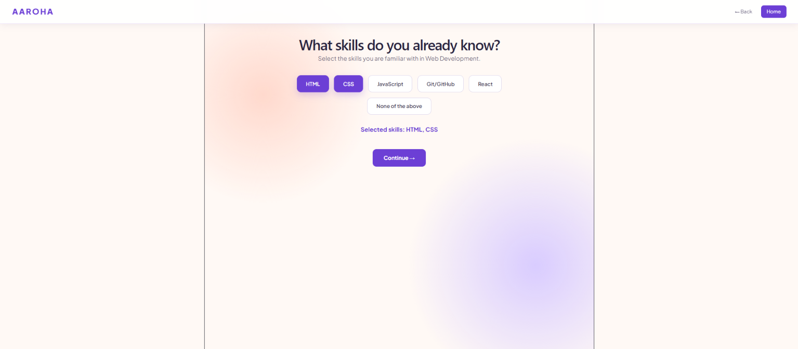
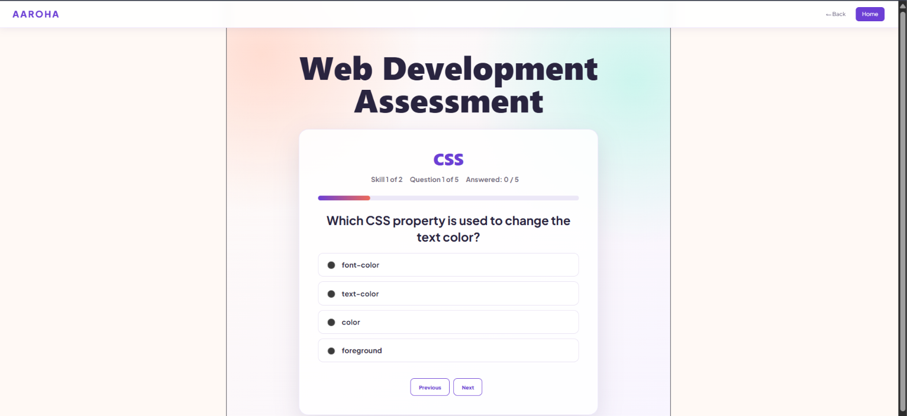
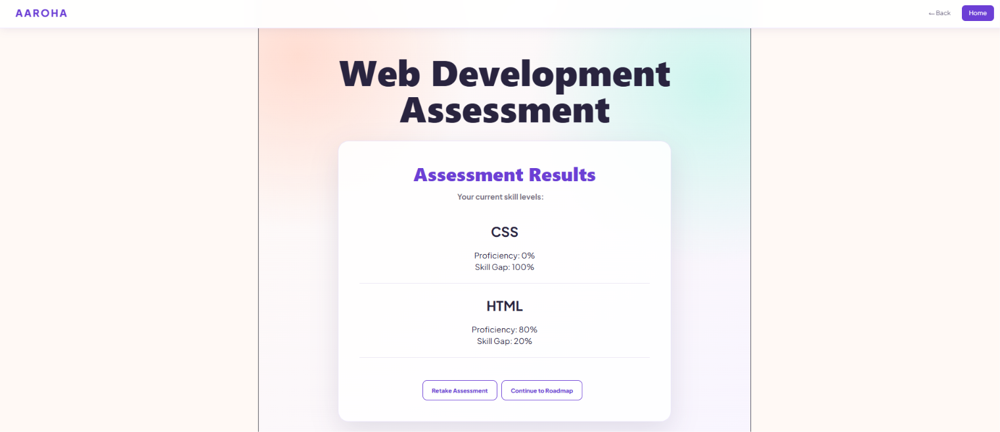
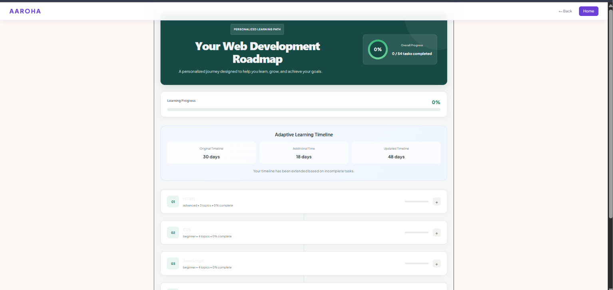
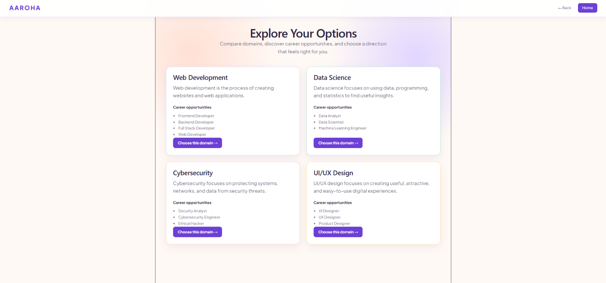
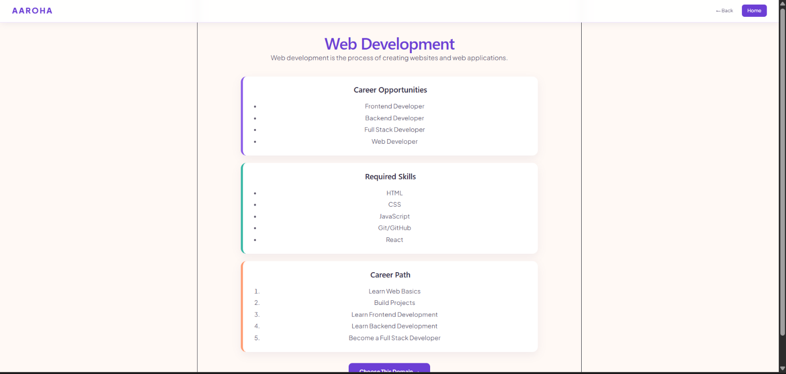
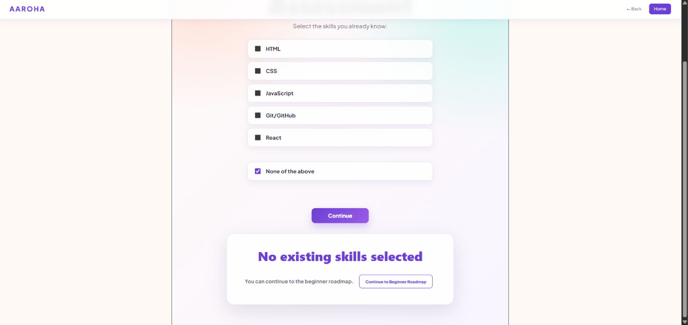

# Aaroha

## Personalized Learning & Career Roadmap Platform

**Aaroha** is a personalized learning platform that helps students understand their current skills, identify the gaps between their existing abilities and their target career, and follow a structured learning path.

The platform focuses on the part of the learning journey that comes **before and around learning content** — understanding where a learner currently stands, identifying what they need to learn, creating a structured roadmap, and eventually tracking and adapting their progress.

**Goal:** Turn a student's current skill set into a clear path toward a target career.

---

## The Problem

Students often face three fundamental questions:

* **What career should I prepare for?**
* **What skills does that career actually require?**
* **What should I learn next?**

Many learners may know what they want to become but do not have a clear path for getting there.

Existing learning platforms can provide courses and learning resources, but the learning journey may still be difficult to personalize because:

* Learning paths are often generic.
* Existing skills are not always considered before starting a learning path.
* Skill gaps are not clearly mapped to a target career.
* Assessment, learning, and progress tracking may exist as separate activities.

Aaroha addresses this gap by connecting these stages into one continuous journey.

---

## Our Solution

Aaroha follows a learner-centered approach:

```text
Assess
   ↓
Compare
   ↓
Identify Skill Gaps
   ↓
Build Roadmap
   ↓
Track Progress
   ↓
Adapt Learning Journey
```

The platform first understands the learner's direction and existing skills. It then uses assessment results to understand the learner's current proficiency and identify the skills that need improvement.

The identified gaps are converted into a structured learning roadmap.

The long-term vision is to allow the learning journey to continuously adapt according to the learner's progress.

---

## How Aaroha Works

The overall Aaroha journey is designed around four stages:

### 1. Discover Your Direction

Learners identify what they want to become or explore suitable domains when they are unsure about their career direction.

### 2. Understand Your Current Skills

Learners select the skills they already know and take a basic skill assessment to understand their current proficiency.

### 3. Get a Personalized Roadmap

The platform analyzes the learner's skill gap and generates a structured roadmap containing technologies, topics, and learning tasks.

### 4. Learn, Track & Adapt

The planned system allows learners to track their task progress while the roadmap and timeline adapt according to their progress.

The current MVP primarily demonstrates the journey through **assessment, skill-gap identification, and personalized roadmap generation**.

---

## Current MVP

The current prototype demonstrates the personalized learning journey for the **Web Development** domain.

### Current Flow

```text
Login
   ↓
Start Journey
   ↓
Career / Domain Intent
   ↓
Domain Selection
   ↓
Select Existing Skills
   ↓
Skill Assessment
   ↓
Skill Proficiency
   ↓
Skill Gap Analysis
   ↓
Retake Assessment / Continue
   ↓
Personalized Roadmap
```

### Detailed Flow

#### Login

The learner begins the journey through the login interface.

#### Start Journey

The learner starts their personalized career-learning journey.

#### Career / Domain Intent

The platform asks the learner about their career direction.

A learner can indicate whether they already know what they want to become or need guidance.

#### Domain Selection

The current MVP focuses on **Web Development**.

#### Existing Skills

The learner selects the skills they already know.

This allows the system to account for prior knowledge instead of treating every learner as a complete beginner.

For example, if a learner already has knowledge of HTML, the learning path can take that existing knowledge into account while identifying areas that need more attention.

#### Skill Assessment

The learner completes a domain-specific assessment to evaluate their current knowledge.

#### Skill Proficiency

The assessment results are presented as skill-wise proficiency information.

For example:

```text
HTML        → Proficiency
CSS         → Proficiency
JavaScript  → Proficiency
```

#### Skill-Gap Analysis

The system compares the learner's current skill level with the expected skills for the selected learning path and identifies areas that require further development.

#### Retake or Continue

After viewing the assessment results, the learner can:

* Retake the assessment
* Continue to the roadmap

#### Personalized Roadmap

The roadmap is generated based on the learner's assessment results and identified skill gaps.

---

## Key Features

### Career-Role Selection

Allows learners to identify the career direction or domain they want to prepare for.

### Skill Assessment

Evaluates the learner's current knowledge and proficiency across relevant skills.

### Existing Skill Recognition

Allows learners to indicate skills they already possess before beginning their learning path.

### Skill-Gap Analysis

Compares the learner's current skills with the skills required for the selected career direction and identifies areas that need development.

### Personalized Roadmap

Converts identified skill gaps into a structured, step-by-step learning path.

### Progress Tracking

The overall system is designed to track completed skills, tasks, and milestones throughout the learner's career-readiness journey.

### Continuous Learning Journey

Aaroha connects:

```text
Skill Selection
      ↓
Assessment
      ↓
Skill Gap
      ↓
Roadmap
      ↓
Tasks
      ↓
Progress
```

instead of treating these as unrelated activities.

---

## Planned Task & Progress System

The roadmap is intended to become more actionable by breaking learning goals into smaller tasks.

### Weekly Tasks

The learner will receive a set of tasks to complete within a particular week.

### Monthly Goals

Weekly tasks can be organized under broader monthly learning objectives.

### Progress Tracking

Learners will be able to track completed and pending tasks as they move through the roadmap.

### Adaptive Timeline

If a learner is unable to complete planned tasks within the original timeframe, the system is intended to update the learning schedule.

For example:

```text
Original Plan

Week 1 → Tasks A, B, C
Week 2 → Tasks D, E, F
Week 3 → Tasks G, H, I
```

If the learner falls behind:

```text
Updated Plan

Week 1 → Tasks A, B
Week 2 → Remaining Task C + Tasks D, E
Week 3 → Tasks F, G
Week 4 → Remaining Tasks H, I
```

The objective is to make the learning journey **adaptive to the learner's actual pace** rather than forcing the learner to follow an unchanging timeline.

 **Note:** Weekly/monthly task scheduling, progress-based timeline adjustment, and advanced adaptive behavior are planned extensions and are not part of the current MVP.

---

## What Makes Aaroha Different?

### Personalized From the Starting Point

Aaroha first considers what the learner already knows before determining what they need to learn.

### One Continuous Learning Journey

The platform connects:

```text
Skill Selection
→ Assessment
→ Skill Gap
→ Roadmap
→ Tasks
→ Progress
```

### Progress-Aware Learning

The planned system can adapt the roadmap and timeline based on the learner's actual progress.

### Career-Oriented Skill Mapping

Instead of only presenting learning resources, Aaroha focuses on understanding the gap between a learner's current skill set and their target career.

---

## System Architecture

The technical approach is organized into frontend, backend, database, and core-logic components.

```text
                         AAROHA
                           │
             ┌─────────────┴─────────────┐
             │                           │
         Frontend                    Backend
             │                           │
     React + Vite                Node.js + Express.js
     JavaScript + CSS                  REST APIs
             │                           │
             └─────────────┬─────────────┘
                           │
                           ▼
                       SQLite
                           │
                           ▼
                  Learner & Progress Data
```
---

### Frontend

The frontend provides interfaces for:

* Learner profile
* Domain exploration
* Career/domain selection
* Skill selection
* Assessment
* Skill results
* Roadmap
* Progress

### Backend

The backend provides REST APIs for handling learner, assessment, skill-gap, roadmap, and progress-related data.

### Database

SQLite is used for storing application data such as:

* Learner profiles
* Skills
* Assessments
* Roadmaps
* Progress

### Core Logic

The core logic handles:

* Skill proficiency calculation
* Skill-gap calculation
* Personalized roadmap generation
* Daily/weekly progress tracking
* Adaptive timeline logic

---

## Application Modules

The system is organized around modular functionality:

### Profile Module

Handles learner profile information.

### Assessment Module

Handles assessment questions and scoring.

### Skill-Gap Module

Calculates the skills that require further development.

### Roadmap Module

Generates the structured learning path and learning tasks.

### Progress Module

Tracks task and learning completion.

---

## Technology Stack

| Layer           | Technologies                 |
| --------------- | ---------------------------- |
| Frontend        | React, Vite, JavaScript, CSS |
| Backend         | Node.js, Express.js          |
| API             | REST APIs                    |
| Database        | SQLite, SQL                  |
| Core Logic      | JavaScript, JSON             |
| Version Control | Git, GitHub                  |

The technical stack and organization above follow the technical approach described in the project presentation.

---

## Project Structure

```text
Aaroha-2026/
│
├── client/
│   └── Frontend application
│
├── server/
│   └── Backend application
│
└── README.md
```

---

## Getting Started

### Prerequisites

Make sure you have the following installed:

* Node.js
* npm
* Git

### Clone the Repository

```bash
git clone https://github.com/thushara-bajimar/Aaroha-2026.git
```

```bash
cd Aaroha-2026
```

### Frontend Setup

```bash
cd client
npm install
npm run dev
```

### Backend Setup

Open another terminal:

```bash
cd server
npm install
node server.js
```

Then run the backend using the command configured in the server project.

---

**Note:** The exact backend start command and environment variables should be updated here once the final project configuration is confirmed.

---


## Future Scope

The following capabilities are planned for future development:

### AI-Powered Learning Recommendations

Analyze learner assessment results, skill gaps, and progress to recommend what the learner should learn next.

### Expansion to More Career Domains

Extend Aaroha beyond the initial domains to areas such as:

* Cloud Computing
* AI/ML
* Digital Marketing
* Other emerging career domains

### Advanced Adaptive Roadmaps

Dynamically modify the learner's roadmap based on:

* Completed tasks
* Performance
* Learning pace
* Progress

instead of following a fixed timeline.

### Industry Skill-Demand Integration

Incorporate current industry skill requirements to help learners understand which skills are relevant to their selected career.

### Internship & Job Matching

Connect learners with relevant internships and entry-level opportunities based on their demonstrated skills, selected domain, and learning progress.

### Institutional Analytics Dashboard

Provide colleges with aggregated insights into:

* Student skill gaps
* Domain preferences
* Learning progress
* Career-readiness trends

These future-scope areas are based on the project's presentation.

---

## Project Status

**Current Stage: Prototype / MVP**

The current MVP demonstrates the core personalized career-readiness flow:

```text
Learner
   ↓
Career / Domain Direction
   ↓
Existing Skills
   ↓
Assessment
   ↓
Skill Proficiency
   ↓
Skill Gap
   ↓
Personalized Roadmap
```


---

## Team Aaroha

* **Thushara**
* **Trisha**
* **Adithi**
* **Spoorthi**

**Institution:** Sahyadri College of Engineering and Management

---
## 📸 Screenshots






















